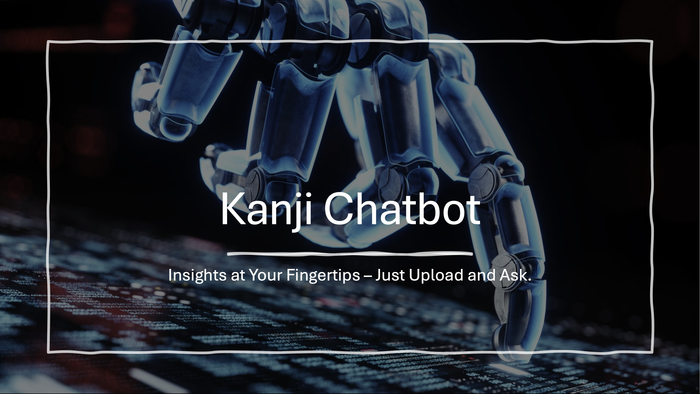
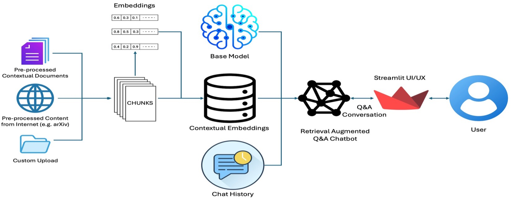

# Context Based ChatBot using Retrieval Augmented Generation (RAG)

This project focuses on implementing a Retrieval Augmented Generation (RAG) system to retrieve domain-specific knowledge using a Large Language Model (LLM) like Gemma2 or its alternatives. Key features include effectively understanding user queries, delivering precise and relevant answers, and creating ethical interaction protocols. The solution incorporates tools such as LangChain, Hugging Face, and Streamlit. All communication and input/outputs will be limited to English language.

## Input:
One or multiple documents containing the information related to multiple particular domains, e.g. for implementation purposes we have used following information:
- Clark University International Admission document
- Research paper – Attention is all you need
- Natural Language Processing course material
- Any custom PDF document(s) user can upload etc.

## Scope of the Project:
The scope of project work involves following activities:
- For RAG system implementation:
  - Utilizing LLM models through Lang-Chain or Hugging-Face library
  - Loading contextual data files in form of text-chunks and store as embeddings in vector database.
  - Based on context of question retrieval of relevant data chunks.
  - Generate response for user.
  - Save response as chat-history.
- Implementation of user interface for chatbot.

## Required Skills and Tools:
The project require proficiency in Python, pandas, numpy for basic development, the use of libraries such as Hugging Face /Lang-Chain library, llama or similar llm API for implantation of RAG over LLM system. Additionally, use of Streamlit library for user interface of ChatBot.

## Methodology:
Our methodology includes the use of natural language processing, large language models and then adding contextual layer above the base model. Step by step methodology is as follows:
- Download pre-trained model through Ollama
  - We will be using “gemma:2b” as base model. Advantage of using this includes its open source, easy integration, and small (need relatively less compute).
- Setting up base model using langchain
  - langchain-community is open-source library that will be used to setup the complete layers with base model.
- Creating Retrieval Augmented Generation (RAG) layer
- Creating web-based user interface for chatbot using Streamlit framework

## Data Processing Pipeline:
- For model training on contextual dataset:
  - Upload files
  - Create documents from files
  - Split documents into chunks
  - Create embeddings for chunks
  - Storing chunks and embeddings in vector database (ChromaDB)
- For conversional Q&A:
  - Create embeddings for user message
  - Search for relevant chunks/documents from vector database
  - Generate response and display to user
  - Add response to context for memory generation.

## Architecture/Design:

## Important Links:
- [Power point of project](./NLP_Project_RAG_System.pdf)

